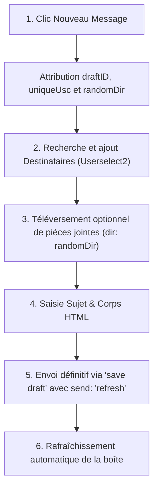

# 💬 API Smartschool — Messagerie Complète (Messages)

Ce document fournit la spécification technique exhaustive du module de **messagerie interne** (`Messages`) de Smartschool, dérivée du code source client officiel (`messages.js`) et des captures réseau XHR.

---

## 1. ⚙️ Architecture RPC XML (`Communicator` & `Dispatcher`)

Contrairement aux API récentes en REST/JSON (`/planner/api/v1/`), le module de messagerie fonctionne via un système RPC XML bidirectionnel :

* **Endpoint central :** `POST /?module=Messages&file=dispatcher` (ou `POST /index.php?module=Messages&file=dispatcher`)
* **Headers HTTP obligatoires :**
  ```http
  Content-Type: application/x-www-form-urlencoded; charset=UTF-8
  X-Requested-With: XMLHttpRequest
  ```
* **Payload :** Un unique paramètre de formulaire POST nommé `command`, contenant une structure XML encodée en URL (`application/x-www-form-urlencoded`).
* **Support du batching (requêtes multiples) :** Smartschool permet d'empiler plusieurs `<command>` dans un unique appel HTTP `<request>` (par exemple : charger le message + charger ses pièces jointes + le marquer comme lu en un seul appel !).

### Format d'Envoi XML

```xml
<request>
	<command>
		<subsystem>postboxes</subsystem>
		<action>show message</action>
		<params>
			<param name="msgID"><![CDATA[123456]]></param>
			<param name="boxType"><![CDATA[inbox]]></param>
		</params>
	</command>
</request>
```

### Format de Réponse XML Serveur

```xml
<server>
	<response>
		<status>ok</status> <!-- ou message d'erreur -->
		<message><![CDATA[Texte d'information ou notification optionnelle]]></message>
		<actions>
			<action>
				<subsystem>message list</subsystem> <!-- sous-système de retour -->
				<action>rebuild</action>            <!-- action de rendu -->
				<data>...</data>                    <!-- données structurées XML -->
			</action>
		</actions>
	</response>
</server>
```

---

## 2. 📁 Dossiers & Compteurs de Messages

### Types de boîtes (`boxType`)
Smartschool gère les dossiers standards et virtuels suivants :
* `inbox` : Boîte de réception (généralement `boxID: 0`)
* `outbox` : Messages envoyés
* `draft` : Brouillons
* `scheduled` : Messages programmés / envoi différé
* `trash` : Corbeille
* `smartfolder` : Dossiers intelligents avec filtres
* `smartbox` : Dossiers personnalisés
* `search` : Résultats d'une recherche

### Calcul des compteurs de messages (`calculate_postbox_counters`)
* **Subsystem :** `postboxes`
* **Action :** `calculate_postbox_counters`
* **Params :** Aucun
* **Réponse :** Tableau JSON dans les sous-nœuds XML pour chaque type (`inbox`, `outbox`, `trash`, `draft`, `scheduled`) avec `{ subid: 0, unread: X, total: Y }`.

### Rafraîchissement rapide des non-lus (`reloadunreadmessages`)
* **Subsystem :** `quickactions`
* **Action :** `reloadunreadmessages`
* **Params :** Aucun

---

## 3. 📥 Liste des Messages (`message list`)

Charge les messages d'un dossier avec pagination ou polling.

### Requête

```xml
<command>
	<subsystem>postboxes</subsystem>
	<action>message list</action>
	<params>
		<param name="boxType"><![CDATA[inbox]]></param>
		<param name="boxID"><![CDATA[0]]></param>
		<param name="sortField"><![CDATA[date]]></param>
		<param name="sortKey"><![CDATA[desc]]></param>
		<param name="poll"><![CDATA[false]]></param>
		<param name="poll_ids"><![CDATA[]]></param>
		<param name="layout"><![CDATA[classic]]></param>
	</params>
</command>
```

Pour une recherche (`boxType: "search"`), l'action devient `search list` avec :
* `searchString` : Mots-clés recherchés
* `searchWhat` : Filtre sur le contenu (`all`, `subject`, `from`, etc.)
* `searchWhere` : Dossier ciblé

### Réponse XML (`MessageL`)
L'action renvoyée est `rebuild` (ou `rebuildnorules`, `rebuild_poll`, `rebuildcontinue`).
Chaque nœud enfant de `<data>` représente un élément `MessageL` avec **15 balises ordonnées** :

| Index (`childNodes[n]`) | Champ | Type | Description |
| :---: | :--- | :---: | :--- |
| `0` | **`id`** | `string` | ID unique du message (ex: `"123456"`). |
| `1` | **`from`** | `string` | Nom affiché de l'expéditeur. |
| `2` | **`fromImage`** | `string` | URL complète de la photo de profil de l'expéditeur. |
| `3` | **`subject`** | `string` | Sujet / Objet du message. |
| `4` | **`date`** | `string` | Date formatée (ex: `"Aujourd'hui 09:12"`, `"24.09.26"`). |
| `5` | **`status`** | `string` | Statut de lecture (`"0"` = non lu, `"1"` = lu). |
| `6` | **`attachment`** | `string` | Nombre de pièces jointes (`"0"` si aucune). |
| `7` | **`unread`** | `string` | Indicateur non-lu. |
| `8` | **`label`** | `string` | Flag couleur (`"0"`/`"none"`, `"1"` = vert, `"2"` = jaune, `"3"` = rouge, `"4"` = bleu). |
| `9` | **`deleted`** | `string` | Marqué comme supprimé (`"0"` ou `"1"`). |
| `10` | **`allowReply`** | `string` | Droit de réponse autorisé (`"0"` ou `"1"`). |
| `11` | **`allowreplyenabled`** | `string` | Bouton de réponse activable (`"0"` ou `"1"`). |
| `12` | **`hasReply`** | `string` | Message ayant déjà reçu une réponse (`"0"` ou `"1"`). |
| `13` | **`hasForward`** | `string` | Message ayant été transféré (`"0"` ou `"1"`). |
| `14` | **`realBox`** | `string` | Dossier réel d'appartenance (`"inbox"`, etc.). |

---

## 4. 📖 Lecture Détaillée d'un Message (`show message`)

Pour charger un message complet, Smartschool regroupe **3 commandes en un seul POST** si le message est non lu :

```xml
<request>
	<!-- 1. Contenu du message -->
	<command>
		<subsystem>postboxes</subsystem>
		<action>show message</action>
		<params>
			<param name="msgID"><![CDATA[123456]]></param>
			<param name="boxType"><![CDATA[inbox]]></param>
			<param name="limitList"><![CDATA[true]]></param>
		</params>
	</command>
	<!-- 2. Liste des pièces jointes -->
	<command>
		<subsystem>postboxes</subsystem>
		<action>attachment list</action>
		<params>
			<param name="msgID"><![CDATA[123456]]></param>
			<param name="boxType"><![CDATA[inbox]]></param>
			<param name="limitList"><![CDATA[true]]></param>
		</params>
	</command>
	<!-- 3. Marquer comme lu (automatique si status == 0) -->
	<command>
		<subsystem>postboxes</subsystem>
		<action>mark message read</action>
		<params>
			<param name="msgID"><![CDATA[123456]]></param>
			<param name="boxType"><![CDATA[inbox]]></param>
		</params>
	</command>
</request>
```

### Schéma du Message Complet (`MessageR`)
Le serveur retourne une action `rebuild` avec **23 balises ordonnées** :

| Index | Champ | Type | Description |
| :---: | :--- | :---: | :--- |
| `0` | **`id`** | `string` | ID unique du message. |
| `1` | **`from`** | `string` | Expéditeur complet. |
| `2` | **`to`** | `string` | Destinataire principal. |
| `3` | **`subject`** | `string` | Sujet. |
| `4` | **`date`** | `string` | Date et heure détaillées. |
| `5` | **`body`** | `html` | **Corps complet du message au format HTML riche.** |
| `6` | **`status`** | `string` | Statut de lecture. |
| `7` | **`attachment`** | `string` | Nombre d'attachements. |
| `8` | **`unread`** | `string` | Indicateur non lu. |
| `9` | **`label`** | `string` | Couleur du drapeau (`"1"` à `"4"`). |
| `10` | **`receivers`** | `DOM Element` | Nœud contenant la liste des `<receiver>` principaux. |
| `11` | **`ccreceivers`** | `DOM Element` | Nœud contenant la liste des destinataires en copie (`CC`). |
| `12` | **`bccreceivers`** | `DOM Element` | Nœud contenant la liste des destinataires en copie cachée (`BCC`). |
| `13` | **`userpicture`** | `string` | Hash photo de l'expéditeur (ex: pour appel `getUserPictureUrl`). |
| `14` | **`markedInLVS`** | `string` | Référence au suivi des élèves (LVS/Livret scolaire). |
| `15` | **`fromOauth`** | `string` | Indique si l'expéditeur est externe/OAuth. |
| `16` | **`otherToReceivers`** | `string` | Nombre de destinataires masqués par la pagination. |
| `17` | **`otherCcReceivers`** | `string` | Nombre de destinataires CC masqués. |
| `18` | **`otherBccReceivers`** | `string` | Nombre de destinataires BCC masqués. |
| `19` | **`allowReply`** | `string` | Droit de réponse accordé. |
| `20` | **`hasReply`** | `string` | Réponse déjà envoyée. |
| `21` | **`hasForward`** | `string` | Message transféré. |
| `22` | **`sendDate`** | `string` | Date d'envoi programmée (si différé). |

---

## 5. 📎 Gestion des Pièces Jointes (`attachment list`)

### Structure d'une pièce jointe (`Attachment`)
Chaque pièce jointe reçue dans l'action `attachment list` comporte 7 attributs ordonnés :
1. `childNodes[0]` : **`fileID`** (ID unique du fichier)
2. `childNodes[1]` : **`name`** (Nom du fichier, ex: `devoir.pdf`)
3. `childNodes[2]` : **`mime`** (Type MIME, ex: `application/pdf`)
4. `childNodes[3]` : **`size`** (Taille lisible ou en octets)
5. `childNodes[4]` : **`icon`** (Icône associée)
6. `childNodes[5]` : **`wopiAllowed`** (`1` si visualisable avec Microsoft Office 365 en ligne, sinon `0`)
7. `childNodes[6]` : **`order`** (Ordre d'affichage)

### Endpoints de Téléchargement & Consultation
* **Téléchargement direct d'un fichier :**
  ```http
  GET /?module=Messages&file=download&fileID={fileID}&target=0
  ```
* **Consultation Office 365 (WOPI) :**
  ```http
  GET /?module=Messages&file=wopi&fileID={fileID}&target=0
  ```
* **Téléchargement groupé de toutes les pièces jointes en ZIP :**
  ```xml
  <command>
  	<subsystem>quickactions</subsystem>
  	<action>downloadZip</action>
  	<params>
  		<param name="msgID"><![CDATA[123456]]></param>
  		<param name="boxType"><![CDATA[inbox]]></param>
  	</params>
  </command>
  ```

---

## 6. 🛠️ Actions sur les Messages (Drapeaux, Suppression, Déplacement, Archivage)

### Marquer comme non lu
```xml
<command>
	<subsystem>postboxes</subsystem>
	<action>mark message unread</action>
	<params>
		<param name="boxType"><![CDATA[inbox]]></param>
		<param name="boxID"><![CDATA[0]]></param>
		<param name="msgID"><![CDATA[123456]]></param>
		<param name="clAction"><![CDATA[status]]></param>
	</params>
</command>
```

### Changer le drapeau couleur (`label`)
Valeurs autorisées : `0` (aucun), `1` (vert), `2` (jaune), `3` (rouge), `4` (bleu).
```xml
<command>
	<subsystem>postboxes</subsystem>
	<action>save msglabel</action>
	<params>
		<param name="boxType"><![CDATA[inbox]]></param>
		<param name="msgLabel"><![CDATA[3]]></param>
		<param name="msgID"><![CDATA[123456]]></param>
		<param name="clAction"><![CDATA[label]]></param>
	</params>
</command>
```

### Supprimer un ou plusieurs messages
```xml
<command>
	<subsystem>postboxes</subsystem>
	<action>delete messages</action>
	<params>
		<param name="boxType"><![CDATA[inbox]]></param>
		<param name="boxID"><![CDATA[0]]></param>
		<param name="msgID"><![CDATA[123456]]></param>
	</params>
</command>
```
*Suppression rapide unitaire :* `subsystem: postboxes`, `action: quick delete`, `params: msgID`.

### Déplacer un message vers un autre dossier (`quickmove`)
```xml
<command>
	<subsystem>postboxes</subsystem>
	<action>quickmove messages</action>
	<params>
		<param name="boxType"><![CDATA[inbox]]></param>
		<param name="boxID"><![CDATA[0]]></param>
		<param name="msgID"><![CDATA[123456]]></param>
		<param name="toBoxType"><![CDATA[trash]]></param>
		<param name="toBoxID"><![CDATA[0]]></param>
	</params>
</command>
```

### Vider la corbeille
```xml
<command>
	<subsystem>postboxes</subsystem>
	<action>empty_trash</action>
	<params></params>
</command>
```

### Archivage (Endpoint JSON Moderne !)
Fait notable dans le code de Smartschool : l'archivage utilise un endpoint REST/JSON dédié au lieu du dispatcher XML !
```http
POST /Messages/Xhr/archivemessages HTTP/2
Content-Type: application/x-www-form-urlencoded; charset=UTF-8

msgIDs[]=123456&msgIDs[]=789012
```
*Réponse :* `{ "success": ["123456", "789012"] }`

---

## 7. ✍️ Rédaction & Expédition de Message

### Cycle de vie complet de l'envoi d'un message :



### 1. Sélection & Vérification des Destinataires
* **Comptage et validation des limites d'envoi :**
  ```http
  POST /?module=Messages&file=searchUsers&function=countUsers HTTP/2
  Content-Type: application/x-www-form-urlencoded

  uniqueUsc=4907e6yNh9rQ92iQpeNEgBBv8SkNw17904223494907
  ```
  *Réponse JSON :*
  ```json
  {
    "amountTo": 1,
    "amountCc": 0,
    "amountBcc": 0
  }
  ```
* **Effacer les destinataires :**
  ```xml
  <command>
  	<subsystem>quickactions</subsystem>
  	<action>clearusers</action>
  	<params>
  		<param name="type"><![CDATA[to]]></param>
  		<param name="uniqueKey"><![CDATA[msgcompose4907e6yNh...]]></param>
  		<param name="field"><![CDATA[0]]></param>
  	</params>
  </command>
  ```

### 2. Téléversement de Pièces Jointes durant la Rédaction
* Fenêtre d'upload Smartschool : `GET /Upload/?dir={randomDir}&mode=1`
* Liste des fichiers téléversés dans le répertoire temporaire :
  ```xml
  <command>
  	<subsystem>quickactions</subsystem>
  	<action>listattachments</action>
  	<params>
  		<param name="randomDir"><![CDATA[yUvaDIKthC74s6VChAQ3syzfD179042234959885748]]></param>
  	</params>
  </command>
  ```
* Suppression d'un fichier attaché avant l'envoi :
  ```xml
  <command>
  	<subsystem>quickactions</subsystem>
  	<action>deleteattachments</action>
  	<params>
  		<param name="randomDir"><![CDATA[yUvaDIKthC74...]]></param>
  		<param name="fileID"><![CDATA[98765]]></param>
  	</params>
  </command>
  ```

### 3. Expédition Finale (`subsystem: draft`, `action: save draft`)
L'envoi définitif réutilise le sous-système de brouillons en passant la commande `send: refresh` :

```xml
<request>
	<command>
		<subsystem>draft</subsystem>
		<action>save draft</action>
		<params>
			<param name="draftID"><![CDATA[2456314]]></param>
			<param name="send"><![CDATA[refresh]]></param>
			<param name="origMsgID"><![CDATA[0]]></param>
			<param name="composeAction"><![CDATA[0]]></param>
			<param name="randomDir"><![CDATA[yUvaDIKthC74s6VChAQ3syzfD179042234959885748]]></param>
			<param name="uniqueUsc"><![CDATA[4907e6yNh9rQ92iQpeNEgBBv8SkNw17904223494907]]></param>
			<param name="subject"><![CDATA[Sujet du message]]></param>
			<param name="bcc"><![CDATA[0]]></param>
			<param name="composeType"><![CDATA[0]]></param>
			<param name="msgID"><![CDATA[0]]></param>
			<param name="message"><![CDATA[<p>Contenu HTML</p>]]></param>
			<param name="preload_type"><![CDATA[]]></param>
			<param name="encryptedSender"><![CDATA[f2cf19ee400347bc788c38d6359d9a73]]></param>
			<param name="sendDate"><![CDATA[]]></param>
		</params>
	</command>
</request>
```

---

## 8. 💻 Implémentation Client Universelle TypeScript

Voici une classe TypeScript complète modélisant le `Communicator` de Smartschool pour exécuter n'importe quelle requête ou lot de requêtes :

```typescript
export interface SmartschoolCommandParam {
  name: string;
  value: string | number;
}

export interface SmartschoolCommand {
  subsystem: string;
  action: string;
  params: SmartschoolCommandParam[];
}

export class SmartschoolMessageCommunicator {
  private dispatcherUrl = '/?module=Messages&file=dispatcher';

  /**
   * Construit la chaîne XML pour une commande
   */
  private buildCommandXml(cmd: SmartschoolCommand): string {
    const paramsXml = cmd.params
      .map(p => {
        const escaped = String(p.value).replace(/]]>/g, ']]]]><![CDATA[>');
        return `\t\t\t<param name="${p.name}"><![CDATA[${escaped}]]></param>`;
      })
      .join('\n');

    return `\t<command>\n\t\t<subsystem>${cmd.subsystem}</subsystem>\n\t\t<action>${cmd.action}</action>\n\t\t<params>\n${paramsXml}\n\t\t</params>\n\t</command>`;
  }

  /**
   * Envoie une ou plusieurs commandes groupées (batching)
   */
  public async sendRequest(commands: SmartschoolCommand[]): Promise<Document> {
    const commandsXml = commands.map(c => this.buildCommandXml(c)).join('\n');
    const requestXml = `<request>\n${commandsXml}\n</request>`;

    const formData = new URLSearchParams();
    formData.append('command', requestXml);

    const res = await fetch(this.dispatcherUrl, {
      method: 'POST',
      headers: {
        'Content-Type': 'application/x-www-form-urlencoded; charset=UTF-8',
        'X-Requested-With': 'XMLHttpRequest'
      },
      body: formData.toString()
    });

    const responseText = await res.text();
    const parser = new DOMParser();
    return parser.parseFromString(responseText, 'text/xml');
  }

  /**
   * Récupère la liste des messages de la boîte de réception
   */
  public async getMessageList(boxType: 'inbox' | 'outbox' | 'draft' | 'trash' = 'inbox') {
    return this.sendRequest([
      {
        subsystem: 'postboxes',
        action: 'message list',
        params: [
          { name: 'boxType', value: boxType },
          { name: 'boxID', value: 0 },
          { name: 'sortField', value: 'date' },
          { name: 'sortKey', value: 'desc' },
          { name: 'poll', value: 'false' },
          { name: 'poll_ids', value: '' },
          { name: 'layout', value: 'classic' }
        ]
      }
    ]);
  }
}
```
